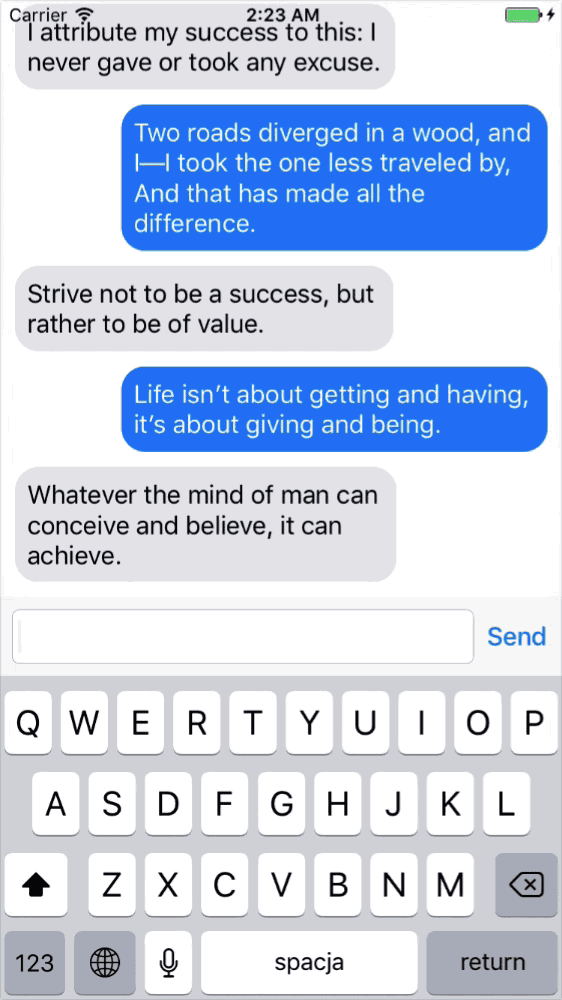

# Messages (iOS)

Messages app prototype for iOS

**Notice: current state of the project is "for R&D purposes only"**

## Description

Disappointed with availabe libraries and components for replicating Messages app UI in iOS application, I decided to create my own solution. It shows how to build chat-alike user interface that allows sending and receiving messages. It's not "one size fits all", not perfect nor optimal. It's definately much simplier than some messaging-UI libraries, and because of this, easier to maintain and customize. Messages list is build using `UICollectionView` managed by [IGListKit](https://github.com/Instagram/IGListKit) library. There is no backend logic in this project - app uses mocked up service that simulates communication with server side.

Special thanks to [turekj](https://github.com/turekj) for help with developing simple solution to preserve `UIScrollView` content offset when reloading data.

## What's inside

- `UICollectionView` managed by [IGListKit](https://github.com/Instagram/IGListKit)
- `UICollectionViewLayout` that displays cells from bottom to top
- Custom `UICollectionViewCell` for representing messages on the list
- Workaround for preserving content offset when adding cells to `UICollectionView`
- Pagination with `UIRefreshControl` that allows loading messages history
- Custom toolbar for composing new messages
- Mocked up service that simulates communication with backend

## License

Copyright © 2017 Dariusz Rybicki Darrarski

[MIT License](LICENSE). You are allowed to use the source code commercially, but licence and copyright notice MUST be distributed along with it.
